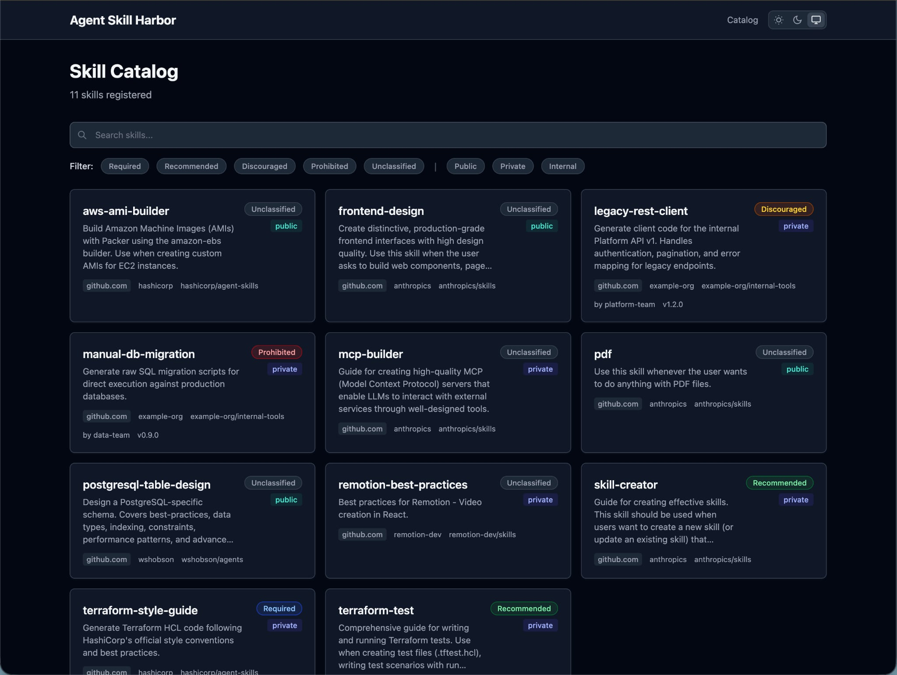
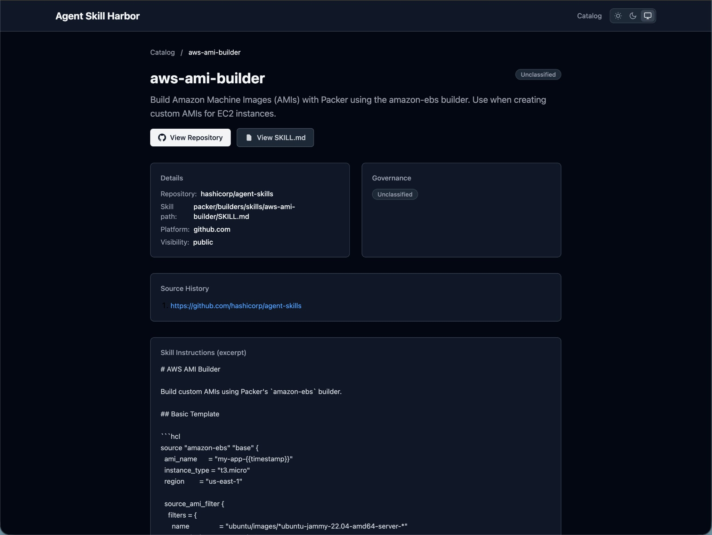

<p align="center"><a href="./README.md">en</a> | <a href="./README_ja.md">ja</a></p>

# Agent Skill Harbor

> Know what your agents know.

Internal agent skill catalog and governance for organizations.

## Screenshots

| Skill Catalog | Skill Detail |
|:---:|:---:|
|  |  |

## Overview

Agent Skill Harbor collects Agent Skills (SKILL.md) from your GitHub Organization's repositories, provides governance controls, and serves a browsable catalog via GitHub Pages.

- No database — Data stored as YAML/JSON in Git
- No backend — Frontend-only web app (SvelteKit, prerendered)
- GitHub-native — GitHub Actions for collection, GitHub Pages for hosting
- Traceable — Track the origin and provenance of every skill, even those installed from external sources

## Quick Start

### Prerequisites

- Node.js 22+
- pnpm 10+

### Development

```bash
# Install dependencies
pnpm install

# Start development server
pnpm dev

# Build catalog from YAML data
pnpm run build:catalog

# Build everything (catalog + web)
pnpm run build
```

### Organization Setup

1. Clone this repository privately into your organization
2. Configure GitHub repository variables and secrets:
   - Variable `GH_ORG`: Your GitHub organization name
   - Secret `ORG_GITHUB_TOKEN`: A token with `repo` scope for your organization
3. Enable GitHub Pages (Settings > Pages > Source: GitHub Actions)
4. Edit `config/governance.yaml` to define your governance policies
5. Trigger the "Collect Skills" workflow manually for initial collection

## Project Structure

```
├── config/               # Human-managed configuration
│   ├── admin.yaml        # Application settings
│   └── governance.yaml   # Governance policy definitions
├── data/                 # Machine-generated skill data
│   ├── catalog.yaml      # Skill catalog metadata
│   └── skills/           # Collected SKILL.md files
├── scripts/              # Collection and build scripts
├── web/                  # SvelteKit frontend application
└── .github/workflows/    # GitHub Actions (collect + deploy)
```

## Skill Provenance Tracking

Using [agent-command-sync](https://github.com/hatappo/agent-command-sync) (`acs`) to install and manage skills automatically records the `_from` history in SKILL.md frontmatter, enabling your organization to trace the origin of every skill.

## License

MIT
